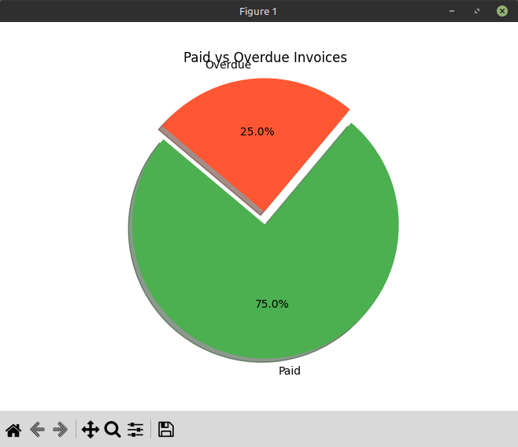

# Invoice Payment Tracker

## Overview

The Invoice Payment Tracker is a project designed to help you track invoices and payments, identify overdue payments, and visualize payment trends. The project uses a SQLite database to store invoice data and provides utilities for querying and visualizing the data.

## Features

- **Track Invoices and Payments**: Store and manage invoice data, including client names, issue dates, due dates, amounts, and payment dates.
- **Identify Overdue Payments**: Query the database to identify invoices that are overdue.
- **Visualize Payment Trends**: Generate visualizations to compare paid vs. overdue invoices.


## Setup

1. **Create Virtual Environment**:
    ```bash
    python -m venv venv
    source venv/bin/activate  # On Windows use `venv\Scripts\activate`
    ```

2. **Install Dependencies**:
    ```bash
    pip install pandas matplotlib
    ```

3. **Set Up Database**:
    ```bash
    python scripts/database_setup.py
    ```

4. **Run Queries**:
    ```bash
    python run.py
    ```

5. **Generate Visualizations**:
    ```bash
    python scripts/visualization.py
    ```

## Usage

- **Track Invoices**: Add your invoice data to [invoices.csv](http://_vscodecontentref_/4).
- **Identify Overdue Payments**: Use the functions in [query_utils.py](http://_vscodecontentref_/5) to query overdue invoices.
- **Visualize Payment Trends**: Run [visualization.py](http://_vscodecontentref_/6) to generate visualizations of paid vs. overdue invoices.

## Example Visualization

